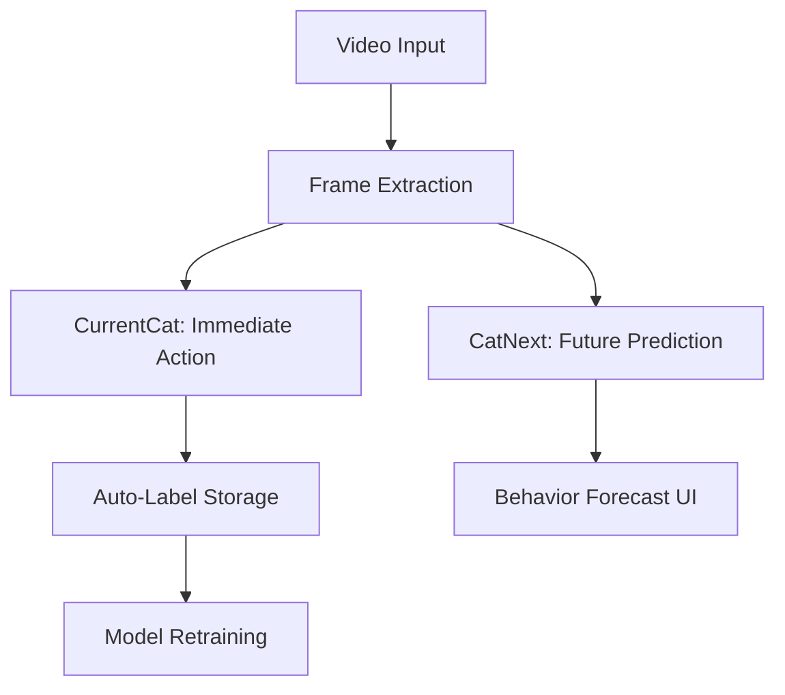

# Cat Behavior Prediction & Auto-Labeling System

Dual-model system for feline behavior analysis:
- **Real-Time Action Recognition** (`currentcat`): Classifies current actions in video streams
- **Behavior Forecasting** (`catnext`): Predicts next 3.25 seconds of cat activities
- **Auto-Labeling Pipeline**: Enables continuous model improvement through user data

## Key Components

### 1. Core Inference Libraries
| Library | Purpose | Tech Stack |
|---------|---------|------------|
| `currentcat` | Real-time action classification | C (optimized inference) |
| `catnext` | Multi-frame behavior prediction | C (temporal modeling) |

### 2. Model Types
```c
// currentcat_model.h
struct ModelInput { /* Single frame data */ }; 

// catnext_model.h 
struct ModelAddInput { /* 300-action history */ };
```

### 3. Integration Layer
- **C# Inference Application**:
  - OpenCV-based video processing
  - Native interop with C models
  - Result interpretation & visualization

## Workflow



## Technical Specifications

### Model Input Requirements
| Parameter | currentcat | catnext |
|-----------|------------|---------|
| Frame Size | 384x384 | 384x384 |
| Channels | 3 (RGB) | 39 (13×3 RGB) |
| Batch Size | 1 | 1 |
| Temporal Context | Single frame | 3.25 sec (13 frames @4Hz) |

### Action Space (66 Classes)
```csharp
// Full spectrum of feline behaviors
"Poops", "Runs forward", "Interacts", "Moves forward and left at 45°", "Moves forward and left at 90°",
"Moves forward and right at 45°", "Moves forward and right at 90°", "Moves forward and turns around", "Eats a mouse",
"Climbs a tree", "Defends itself", "Plays with another cat", "Plays with a child",
"Walks home", "Walks and meows", "Approaches a person", "Walks forward", "Digs a hole",
"Eats", "Lies down and grooms itself", "Climbs", "Catches a mouse", "Jogs lightly", "Takes small steps",
"Turns left 45°", "Turns left 45° and moves forward", "Turns left 90°", "Turns left 90° and moves forward", "Turns left and runs forward",
"Attacks head-on", "Turns right 45°", "Turns right 45° and moves forward", "Turns right 90°", "Turns right 90° and moves forward",
"Sniffs while walking", "Sniffs to the left", "Sniffs to the right", "Circles around obstacle to the left", "Widely circles around obstacle to the left",
"Circles around obstacle to the right", "Widely circles around obstacle to the right", "Rests", "Jumps over", "Turns around",
"Sneaks up", "Ascends", "Got through", "Got through and jumps", "Squeezes through", "Jumps down",
"Jumps forward", "Jumps upward", "Drinks water", "Turns around and leaves",
"Climbs down", "Stands and meows", "Stands and sniffs", "Stands and looks around",
"Stands and glances up/down", "Stands and looks 180° left", "Stands and looks 90° left",
"Stands and looks 180° right", "Stands and looks 90° right", "Stands and grooms itself",
"Gets cuddled", "Walks over something"
```

### Advanced Features
- **Historical Context Encoding** (catnext):
  ```csharp
  // 300-action window normalized via:
  (actionID + 1) * (1.0f / 66.0f)
  ```
- **Frame Failure Resilience**:
  - Last valid frame duplication
  - Graceful video EOF handling

## Usage

```bash
CatNextInference.exe <video_path>
```

Sample Output:
```
Predicted action: Climbs a tree
```

## Development

### Build Requirements
- OpenCV 4.x (C# bindings)
- C11-compliant compiler
- .NET Core 6.0+
